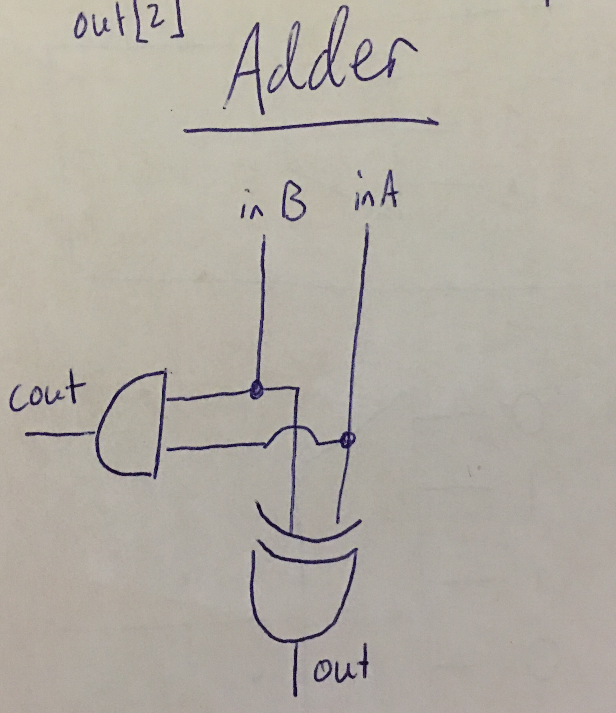

# CompArch 2015 Midterm
##### David Abrahams

## Specification Document

### Operational Modes

There are four operational modes for the bike light. They are, in order:

* Off -- The LED stays `LOW`.
* On -- The LED stays `HIGH`.
* Blinking -- The LED flickers between `LOW` and `HIGH`. This is a relatively slow flicker; the LED holds state for many clock cycles before changing. We will assume that the Blinking stage has a period of 1 second, meaning that for a 32,768 Hz clock, the state changes every 16,384 clock cycles.
* Dim -- The LED stays on, but is dimmed. We achieve this through PWM. In order for the LED to be dim, on every clock positive edge, the LED will change states. Therefore, it will flicker so quickly it will appear dim to a human eye.

### Specification Summary

* Clock speed -- 32,768 Hz
* Period of Blinking state -- 1 second
* Frequency of Dim state -- 16,384 Hz. This is half the clock speed because it takes two clock cycles to cycle through all Dim states: 1 cycle for `HIGH`, 1 cycle for `LOW`.

### Input

This bike light has a single input button. The button has two states, `HIGH` when pressed and `LOW` otherwise. The input button causes the current state to shift forward on its negative edge (and in the case of the button being pressed while the state is Dim, the state is reset to Off). We increment the state on the negative edge because the light switches state when the button is released. This is a design decision that we make.

### Output

Our output is a single LED which can either be on or off. The following is a graph of LED output for each operational mode. Note that the LED can only be `HIGH` or `LOW`, so for the Dim state, we use PWM to simulate dimming.

### FSM

Shown below is an FSM representation of our bike light.

There are six different states for the FSM:

* Off -- The light is off. This state transitions to On on a button release.
* On -- The light is on. This state transitions to Blink_On on a button release.
* Blink_On -- The light is in the Blinking operational mode. The light is currently on. It stays in this FSM state for 16,384 clock cycles (since the count starts from 0, the transition occurs after `count=16,383`), and then transitions to Blink_Off. On a button release, this state transitions to Dim_On.
* Blink_Off -- The light is currently off. It stays in this FSM state for 16,384 clock cycles, and then transitions to Blink_On. On a button release, this state transitions to Dim_On.
* Dim_On -- The light is in the Dim operational mode. The light is currently on. It transitions to Dim_Off every clock cycle, unless there is a button release, in which case this state transitions to Off.
* Dim_Off -- The light is in the Dim operational mode. The light is currently off. It transitions to Dim_On every clock cycle, unless there is a button release, in which case this state transitions to Off.

The decision to split Blink and Dim into two different FSM states was made in order to make setting the LED output more simple. By splitting the stages, each stage directly corresponds to an LED output.

### Block Diagram

Because all program logic is handles by our FSM and how it transitions between stages, our high level block diagram is quite simple.

We take the button, condition it, and then pass on whether or not the button was just released to the FSM. The FSM uses the button press along with its own logic to determine which state to be in, and then sets the output of the LED accordingly.

#### Input Conditioner

The input conditioner conditions an output by only changing its output if the input has been the same for 33 consecutive clock cycles. We do this in order to ensure the flickering in the first millisecond after a button press does not affect output. (Each clock cycle is 1/32,768=0.03 milliseconds. 33 clock cycles = 1.007 milliseconds.) The conditioner passes the input through 2 flip flops. When the output of the second flip flop is different than the current output, we increment count. When `count=33` (we check this by with a 6-bit `NOR` gate that checks if the middle 4 bits of `count` are `0` and the outer two are `1`, as `33=100001`), we change the output, reset `count`, and set `negedge` if the new value is `0`.

* Inputs -- `noisysignal` (the button) and `clk`
* Outputs -- `conditioned`
* Size --

#### FSM

The FSM transitions between the six states previously described. The top mux sets the next stage if there is no button press (On and Off stay in their stage, Blink_on and Blink_off transition between eachother when the `count=16,383`, and Dun_On and Dim_Off always transition to eachother). The second mux sets the next stage if the button was released (Off -> On -> Blink -> Dim). The outputs of both of these muxes is selected by another mux whose control signal is `negedge_in`.

The third mux sets the `count`. The `count` is `0` unless we are in a Blink stage, in which case `count=count+1` unless `count=16,383`.

The buttom mux sets the output of the LED based on the current state. The LED is on in states On, Blink_On, and Dim_on.

Both `count` and `curr_state` are set using positive-edge-triggered D flip flops. The design decision to not write-enable these flip flops and rather update these values every clock cycle was done in order to simplify the design of the FSM, perhaps at the cost of efficiency. Additionally, some muxes could have been eliminated and replaced with gate-logic, which again, was not done in order to simplify design and maximize readability.

* Inputs -- `Clk` and `negedge_in`
* Outputs -- `LED`
* Size --

#### +1

Both the FSM and the Input Conditioner require an n-bit wire (6 bits in the conditioner, 14 bits in the FSM) to be incremented by 1. We do this by linking a series of Full Adders together. Shown above is the schematic for a 14 bit incrementer.

* Inputs -- `count`
* Outputs -- `out=count+1`
* Size --

#### Adder

The adder takes in two binary inputs and returns a result and a carry out.

* Inputs -- `inA` and `inB`
* Outputs -- `out` and `Cout`
* Size --
* Cost --

#### =16,383

In order to check `count=16,383`, we simply `AND` its 14 bits together. (The binary representation of `16,383` is `11,1111,1111,1111`.)

* Inputs -- `count`
* Outputs -- `out`
* Size --
* Cost --
